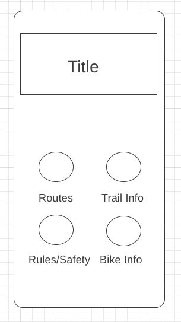

# bike_mso

A flutter application that provides cycling routes and information for the Missoula area.

## Wireframes of GUI

### Home_screen

## Database schema

~~~
Routes {
	routeId {
		description: ‘description’,
		directions: ‘directions’,
		image: ’image file name’,
		markers: [
			0: {
				markerID: ‘marker Id’,
				position: {
					latitude: number Lat,
					longitude : number Long	
				},
				title: ‘markerTitle’,
				infoWindow {
					snippet: ‘marker info snippet’,
					title: ‘marker title’	
				}
			}	
		],
		polyline: ‘encodedPolyline’,
		routeName: ‘route name’
		shortDescription: ‘short description’
		
	 }

}
~~~
